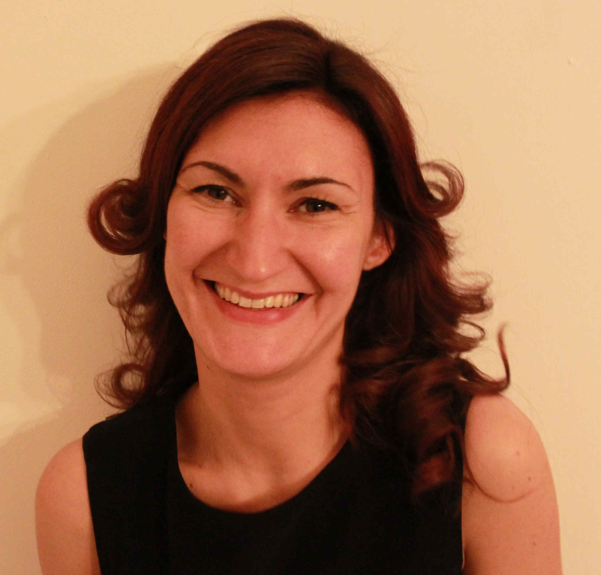

# Laura Po

<table>
<tr>
<td width="30%">

</td>
<td>

**Associate Professor**  
Department of Engineering "Enzo Ferrari"  
[University of Modena and Reggio Emilia](https://www.unimore.it/en)  

📍 Via Pietro Vivarelli 10, 41125 Modena, Italy  
📧 laura.po [at] unimore.it   
📞 Office: +39 059 205 6255   
📱 Mobile: +39 349 424 0131  
</td>
</tr>
</table>

## About

I am an Associate Professor at the [Department of Engineering “Enzo Ferrari”](https://www.dief.unimore.it/en) at the University of Modena and Reggio Emilia.

I am a member of the Board of the [International Doctoral School in ICT](https://www.ict.unimore.it/) of the University of Modena and Reggio Emilia and a member of two Interdepartmental Research Centers at UNIMORE: [DHMore](https://www.dhmore.unimore.it/) on Digital Humanities and [AIRI](https://www.airi.unimore.it/), the Artificial Intelligence Research and Innovation Center.

I am co-founder and member of the Scientific Committee of [DataRiver srl](https://www.datariver.it/en/); the Spin-Off designs and develops solutions for data integration using techniques from research in the field of the Semantic Web.

---

## Research Areas

My research focuses on **Data Management, Artificial Intelligence and Urban Data Analytics**, with particular interest in:

- Big Data Management
- Urban Data and Smart Cities
- Digital Twin for Urban Systems
- Semantic Web and Linked Open Data
- Data Visualization
- Artificial Intelligence
- Urban Mobility Analytics
- Graph-based Mobility Analysis
- Natural Language Processing

---

## Current Research Projects

- AIQS – AI-enhanced Air Quality Sensor for Optimizing Green Routes  
- GreenTrace – AI and Data-driven Traceability for Agro-Food Products  
- ECOSISTER – Ecosystem for Sustainable Transition of Emilia-Romagna  
- Lively Ageing – Technologies for elderly wellbeing

---

### Profiles

## Academic Profiles
- [Official profile – University of Modena and Reggio Emilia](https://unimore.unifind.cineca.it/get/person/090944)
- [Google Scholar](https://scholar.google.com/citations?user=zpBeoc8AAAAJ&hl=en&oi=ao)
- [Scopus](http://www.scopus.com/authid/detail.url?authorId=23467730400)
- [ORCID](http://orcid.org/0000-0002-3345-176X)

## Professional Profiles
- [LinkedIn](http://www.linkedin.com/in/laurapo)
- [ResearchGate](https://www.researchgate.net/profile/Laura_Po2)
